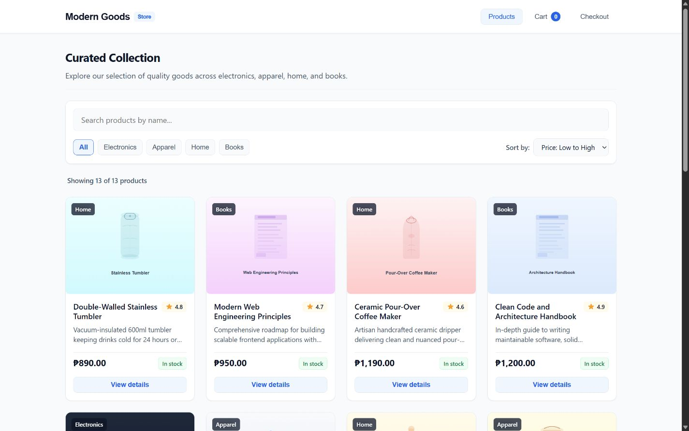

# Simple Online Store

A free starting point for an online store, built with React and TypeScript. The sample shop is called **Modern Goods** and uses Philippine pesos.

Browse products, manage a shopping cart, and try a complete demonstration checkout. You can adapt the code for learning, personal projects, or a business under the [MIT License](LICENSE).

**Checkout is a demonstration.** It does not collect payments, send orders to a business, or save customer details on a server. Before accepting real customers, add a backend for orders, server-side price and stock checks, and a payment provider.



## What you can do

- Browse 13 sample products across four categories.
- Search by product name, filter by category, and sort by price or name.
- View product information, ratings, prices, and stock availability.
- Select quantities, add items to a cart, change quantities, and remove items.
- See the subtotal, shipping fee, and total update automatically.
- Refresh the page and keep your cart on the same browser and site address.
- Enter delivery information, choose a demonstration payment method, and receive an order confirmation.

## Start the app on your computer

### 1. Install Node.js

Use **Node.js 24 or newer**, which includes npm, the tool that installs this project's dependencies. Node.js 24.12.0 was used for the release checks.

Check your installation in a terminal:

```sh
node --version
npm --version
```

### 2. Download the project

If you use Git:

```sh
git clone https://github.com/lionelpiere/simple-online-store.git
cd simple-online-store
```

You can also select **Code > Download ZIP** on GitHub, extract the ZIP, and open a terminal inside the extracted folder. You are in the right folder when it contains `package.json`.

### 3. Install the dependencies

```sh
npm ci
```

This installs the versions recorded in `package-lock.json`. Each project uses its own `node_modules` folder. You do not need to install dependencies again every time you start the app.

### 4. Start the app

```sh
npm run dev
```

Open the address printed in the terminal, usually `http://localhost:5173`. Keep that terminal open while using the app. Press `Ctrl+C` in the terminal to stop it.

No account, database, API key, or environment file is needed for this demo.

## Try the shopping flow

1. Open **Products** and try the search box, category buttons, and sorting menu.
2. Open a product's details, choose a quantity, and select **Add to cart**.
3. Open **Cart**, adjust a quantity, and check the updated total.
4. Refresh the page, then reopen **Cart** to check that the items were restored.
5. Go to **Checkout** and submit an empty form to see the validation messages.
6. Fill in sample customer and shipping details. Choose **Cash on delivery** or **Demo card**.
7. Select **Place demonstration order**. The confirmation keeps a copy of the purchased items and totals, and the active cart is cleared.

Use made-up customer details when testing. Both payment options are simulated and neither collects money.

## Change the store

Keep `npm run dev` running while editing. Save a file and check the browser to see the change.

| What you want to change | Where to edit |
| --- | --- |
| Store name, header, and footer | `src/App.tsx` |
| Browser tab title and search description | `index.html` |
| Browser tab icon | `public/favicon.svg` |
| Product names, descriptions, prices, ratings, and stock | `src/data/products.ts` |
| Product images | `public/products/` |
| Product categories and filter buttons | `src/types/ecommerce.ts` and `src/components/ProductList.tsx` |
| Shipping fee and free-shipping threshold | `src/utils/cartCalculations.ts` |
| Currency formatting | `src/utils/currency.ts` |
| Shared colors, fonts, spacing, and buttons | `src/index.css` |
| Product listing and details layout | `src/styles/catalog.css` |
| Cart layout | `src/styles/cart.css` |
| Checkout layout | `src/styles/checkout.css` |
| Confirmation layout | `src/styles/confirmation.css` |
| Checkout fields and validation | `src/components/CheckoutForm.tsx`, `src/types/ecommerce.ts`, and `src/utils/checkoutValidation.ts` |
| Cart storage behavior | `src/services/storage.ts` |

### Add or edit a product

Open `src/data/products.ts`. Edit an existing product or add another object to the `PRODUCTS` array:

```ts
{
  id: 'prod-home-04',
  name: 'Ceramic Mug',
  description: 'A reusable mug for coffee or tea.',
  priceCents: 35000,
  rating: 4.5,
  category: 'Home',
  stock: 12,
  imageUrl: '/products/ceramic-mug.svg',
  isAvailable: true,
},
```

For this example, add your own `ceramic-mug.svg` file inside `public/products/`. The image URL starts with `/products/`, without `public` in the path. PNG, JPEG, and WebP files can also be used.

- Give every product a unique ID and keep that ID stable when editing it. Saved carts use the ID to find the product.
- Store prices as whole centavos: `35000` means PHP 350.00.
- Use a rating from 0 to 5 and a whole-number stock quantity.
- Set `stock` to `0` or `isAvailable` to `false` to make a product unavailable.
- Use an existing category. To add a new category, update both the `ProductCategory` type and the `CATEGORIES` list in the files shown above.

### Change shipping

Edit these constants in `src/utils/cartCalculations.ts`:

```ts
export const SHIPPING_FEE_CENTS = 5000;
export const FREE_SHIPPING_THRESHOLD_CENTS = 100000;
```

The current rules are:

- An empty cart has no shipping charge.
- A subtotal below PHP 1,000 has a PHP 50 shipping fee.
- A subtotal of PHP 1,000 or more gets free shipping.
- Total equals subtotal plus shipping. No tax or discount is added.

If you change the rules, update their tests in `src/utils/cartCalculations.test.ts` too.

### Change colors or currency

The `:root` section of `src/index.css` contains the shared design values. For example, change `--color-brand` and `--color-brand-hover` to change the main button colors.

The current formatter is `formatCentsToPhp` in `src/utils/currency.ts`. To use another currency, update the formatter and the currency wording in `src/App.tsx`. Update sample prices and shipping amounts for the new currency as well. Changing a currency symbol does not convert prices.

## Check your changes

Run these commands from the project folder:

| Command | Purpose |
| --- | --- |
| `npm test` | Check calculations, cart rules, storage handling, form validation, and order snapshots. |
| `npm run typecheck` | Check TypeScript types. |
| `npm run lint` | Check for common code problems. |
| `npm run build` | Check types and create the production files in `dist/`. |
| `npm run preview` | Preview an existing production build locally. |

To preview a production build:

```sh
npm run build
npm run preview
```

Also try the shopping flow in the browser after changing the interface. Automated tests do not check every screen or visual state.

## How the project is organized

```text
public/products/   Local product illustrations
src/components/    Product, cart, checkout, and confirmation screens
src/context/       Shared cart state
src/data/          Sample product catalog
src/services/      Browser storage handling
src/styles/        Styles for each feature
src/types/         Shared TypeScript data definitions
src/utils/         Calculations, validation, formatting, and order helpers
src/App.tsx        Main application and screen navigation
src/index.css      Shared styles
src/main.tsx       Application entry point
```

Test files sit beside the code they check and have names ending in `.test.ts`.

## Data and demo limits

- The cart is stored in the browser under `modern_goods_cart_v1`. Only product IDs and quantities are saved.
- Prices and product details come from the local catalog when the cart is loaded.
- Invalid saved entries are discarded, duplicate entries are merged, and quantities are capped at current stock.
- When saving fails, the cart remains usable in memory. Those changes may not survive a refresh.
- Customer information and the order confirmation are kept in memory only. Refreshing returns to the catalog and clears the confirmation.
- The catalog is sample data. Inventory is not shared between customers and placing a demo order does not reduce stock in a database.
- There is no payment connection, order database, customer account system, or delivery service.
- Publishing this repository shares the source code. It does not automatically create a live shopping website.

## Keep private information out of the project

This demo needs no secrets. Do not put passwords, API secrets, private keys, or real customer information into source files, product data, screenshots, or documentation.

The ignore file excludes dependencies, build output, local work notes, environment files, and common private-key files. If you later add a backend, keep its secrets on the server. Values exposed to frontend code, including `VITE_` environment values, can be read by visitors.

Before sharing changes, review the files being committed. An ignore rule does not remove a secret that was committed previously.

## Common setup problems

- **`node` or `npm` is not found:** install Node.js, then reopen the terminal.
- **Installation or build reports an unsupported Node version:** use Node.js 24 or newer and run `npm ci` again.
- **The default address is already in use:** open the address printed by Vite, which may use a different port.
- **A product image is missing:** check its filename, capitalization, and path in the product catalog.
- **A cart disappears after changing the address or port:** browser storage belongs to that site address. Use the same address to restore the same cart.
- **Preview does not start:** run `npm run build` before `npm run preview`.

## License and artwork

Released under the [MIT License](LICENSE). You may use, modify, share, and sell software based on this code while keeping the copyright and license notice.

The sample product illustrations are local SVG files included with this project. If you replace them with third-party images, follow the image owner's license and credit requirements.
